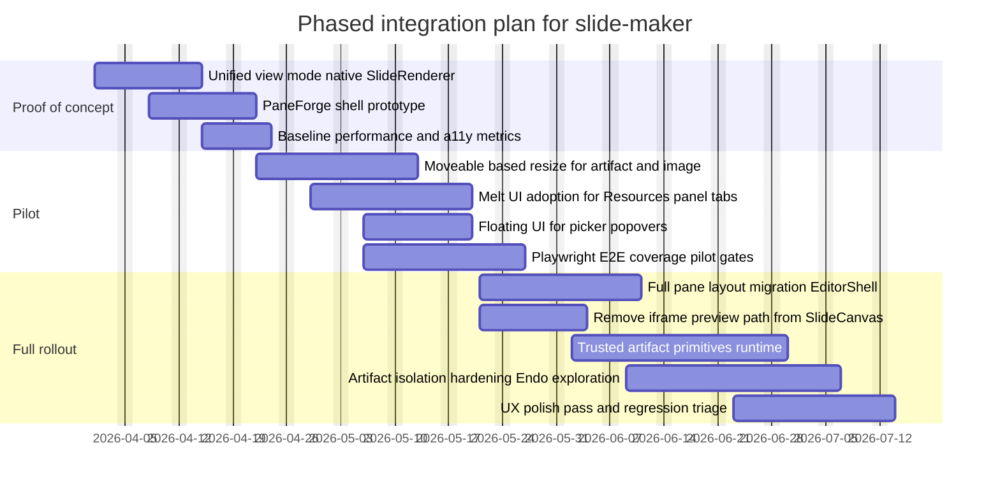

# Integrating JavaScript Libraries into slide-maker for Better Block Handling, UI Consistency, and a Native Resources Panel

## Executive summary

The current `slide-maker` codebase already has the right primitives for a strong editor, since it centralizes deck and slide models in `packages/shared`, persists slides and blocks via `apps/api` with Drizzle on SQLite, and renders edit mode through a native `SlideRenderer` rather than an iframe. citeturn16view0turn12view4turn25view2 At the same time, two core seams still drive UI friction and long term complexity.

First, view mode and artifact execution still rely on iframes. The slide canvas uses an iframe with `srcdoc` for preview mode and sets `sandbox="allow-scripts"`. citeturn35view1 Artifacts also render through an iframe, either via `srcdoc` for stored raw HTML or via an `src` URL, again with `sandbox="allow-scripts"`. citeturn32view0turn32view1 This matches your phase list, where you push toward a unified view mode that replaces iframe preview with a native renderer, then push artifact hardening. citeturn35view1turn18view0turn32view1

Second, block resize, selection, and layout constraints still live in bespoke code paths. The module wrapper currently implements a custom corner resize path that writes pixel dimensions into module data for image and artifact blocks, and uses CSS scale as a fallback when content exceeds the wrapper. citeturn41view5turn41view6 Slide reorder already uses `svelte-dnd-action` and persists order through a dedicated reorder endpoint, which shows a working pattern for optimistic UI plus server persistence. citeturn39view0turn40view3turn40view6

A high leverage integration set follows from that reality in a way that aligns with your seven phases.

- A unified renderer in view mode is already structurally simple because edit mode uses `SlideRenderer`, while preview mode still uses iframe `srcdoc`. citeturn35view1turn25view2  
- A pane layout system can replace ad hoc panel sizing and give you durable, accessible, persistent split views across outline, canvas, chat, and resources. PaneForge targets that exact gap for Svelte and provides persistence hooks. citeturn45search3turn47view0  
- A headless accessibility first component layer can reduce bespoke UI code and stabilize interactions across toolbars, dialogs, tabs, and pickers. Melt UI is built for Svelte and prioritizes WAI ARIA correctness. citeturn45search0turn45search11  
- A positioning primitive for menus and popovers can remove manual geometry and improve interaction reliability. Floating UI has large adoption and active releases through 2026. citeturn47view2turn44search18turn44search30  
- If you truly need artifact execution without iframes, you need isolation at the language runtime layer rather than at the DOM boundary. Endo provides SES based confinement and is explicitly built for plugin systems and supply chain resistance, and Agoric’s Realms shim docs recommend Endo as the safer option. citeturn44search1turn44search13turn47view1  
- For artifact templates that you ship as trusted primitives rather than untrusted HTML, Unovis gives a Svelte compatible visualization framework with Apache 2.0 licensing and recent releases. citeturn44search11turn47view3turn44search23

The concrete recommendation set below keeps the repo’s current data model intact where it is strong, shifts rendering and UI composition toward stable primitives, and adds schema level versioning only where conflict detection is currently impossible at block granularity.

## Repo profile and audit checklist

The repo uses a monorepo layout with `apps/web` for the SvelteKit client, `apps/api` for the backend, and `packages/shared` for common types, validation, and canonical framework CSS. citeturn3view0turn19view0turn14view0turn18view0 The backend schema stores slides, content blocks, templates, themes, and artifacts in SQLite tables via Drizzle. citeturn12view4 The shared data model indicates slide layouts, zones, module types, and a typed map for module payloads, including artifact payload fields such as `src`, `width`, and `height`. citeturn17view0turn16view0

### Inventory checklist for an integration audit

Frontend components  
- [ ] Map render surfaces  
  - Edit canvas uses `apps/web/src/lib/components/canvas/SlideRenderer.svelte`. citeturn25view2  
  - Preview mode uses iframe `srcdoc` inside `apps/web/src/lib/components/canvas/SlideCanvas.svelte`. citeturn35view1  
  - Artifact blocks render inside `apps/web/src/lib/components/renderers/ArtifactModule.svelte` with iframe `sandbox="allow-scripts"`. citeturn32view0turn32view1  
- [ ] Identify block wrapper mechanics  
  - Module wrapper resize routes through custom mouse listeners and persists pixel size into module data for artifact and image types. citeturn41view5turn41view6  
- [ ] Identify list reorder mechanics  
  - Slide list reorder uses `svelte-dnd-action` and persists via `POST /api/decks/{id}/slides/reorder`. citeturn39view0turn40view3  

State management  
- [ ] Document store boundaries  
  - `currentDeck` acts as the anchor store for slides and metadata, with multiple components subscribing and updating it. citeturn40view6turn25view2  
- [ ] Identify optimistic update patterns  
  - Slide reorder updates `currentDeck` first, then calls the API. citeturn40view3turn40view6  
  - Slide split ratio updates the local slide state and calls an API update path. citeturn25view2  

DOM model and layout semantics  
- [ ] Confirm flow layout assumptions  
  - Slides render zones as flex containers and place modules in ordered lists per zone, so most modules remain in document flow. citeturn25view2  
- [ ] Identify any absolute positioning paths  
  - Current module sizing uses wrapper constraints with optional CSS `transform: scale(...)` rather than absolute reposition. citeturn41view6  

Event system  
- [ ] Enumerate pointer paths  
  - Custom resize uses `mousemove` and `mouseup` on `window`. citeturn41view5  
  - Drag reorder uses `svelte-dnd-action` event contracts. citeturn40view0turn40view6  
- [ ] Define editor selection semantics  
  - There is no unified multi select or selection store for modules today, which blocks advanced drag, snap, and group resize. citeturn41view5turn25view2  

Accessibility  
- [ ] Audit custom overlays and role usage  
  - Preview overlay uses clickable div overlay with `role="button"` and keyboard handling. citeturn35view1  
  - Several components suppress a11y lint rules for click handlers on divs. citeturn35view1turn32view0  
- [ ] Confirm resize handles and drag handles expose keyboard routes  
  - Current corner resize handle is mouse only. citeturn41view5  

Performance  
- [ ] Budget iframe count and costs  
  - Each artifact block can introduce an iframe, and preview mode introduces another. citeturn35view1turn32view0  
- [ ] Measure layout thrash in resize and editor render  
  - Custom resize routes through continuous mouse events and updates wrapper styles. citeturn41view5  

Backend APIs  
- [ ] Document mutation endpoints and payload shapes  
  - Slide reorder depends on a dedicated endpoint and expects a list of slide ids. citeturn40view3  
  - Template apply uses `POST /api/decks/{deckId}/slides` with layout and modules payload. citeturn28view3  

Storage and schema  
- [ ] Confirm JSON storage constraints  
  - `content_blocks.data` stores JSON as text, and templates store modules as JSON arrays. citeturn12view4turn16view0turn17view0  
- [ ] Identify fields missing for concurrency  
  - `content_blocks` does not include `updatedAt`, which constrains conflict detection at block granularity. citeturn12view4  

CI and CD  
- [ ] Map existing test scaffolding and planned Playwright suite  
  - Treat your phase list as a contract and bind it to CI gates once Playwright covers all module types and artifacts.  

## Library candidates and prioritization

The repo already ships several relevant libraries in the web client, including Moveable, `svelte-moveable`, `svelte-dnd-action`, DOMPurify, and TipTap, so this work is less about adding dependencies and more about promoting a small set of primitives to first class editor infrastructure. citeturn6view0turn41view5turn35view1

### Prioritized candidate set with fit signals

The table emphasizes libraries with direct leverage on your goals, strong adoption, and a clear Svelte compatible integration story.

| Priority | Category | Library | What it adds | License | Maturity signals | Key pros | Key cons | Integration complexity | Recommended use cases | Repo |
|---|---|---|---|---|---|---|---|---|---|---|
| 1 | Drag and resize | Moveable | Rich resize, rotate, snap, group, and selection adjacent tooling | MIT citeturn46view0turn44search0 | 10.7k stars, 1,612 commits shown citeturn46view0 | Mature feature set, snapping support, multi target support in ecosystem citeturn46view0 | DOM flow layouts still need a clear positional model | Medium | Replace bespoke resize, add snapping, establish selection model | `https://github.com/daybrush/moveable` citeturn46view0 |
| 2 | Pane layout | PaneForge | Resizable pane groups with persistence, nested layouts, accessibility | MIT indicated by ecosystem sources citeturn45search18turn47view0 | 636 stars, npm publish within a month citeturn47view0turn45search15 | Fits Svelte directly, persistent layouts, keyboard goals citeturn45search3turn45search15 | New dependency that touches top level layout | Medium | EditorShell split panes, Resources panel drag widths, chat and outline layout | `https://github.com/svecosystem/paneforge` citeturn47view0turn45search3 |
| 3 | Component system | Melt UI | Headless accessibility first builders for consistent UI | MIT citeturn45search0turn45search16 | 4.1k stars, many releases, active ecosystem citeturn45search0turn45search11 | Strong ARIA posture, SvelteKit support, unstyled builders fit your CSS framework work citeturn45search0turn45search11 | Adds a new UI idiom across components | Medium | Tabs, dialogs, menus, popovers, command palette, picker surfaces | `https://github.com/melt-ui/melt-ui` citeturn45search0turn45search1 |
| 4 | Overlay positioning | Floating UI | Reliable tooltip, menu, and popover geometry and interaction helpers | MIT citeturn44search2turn47view2 | 32.5k stars, `@floating-ui/core` published 15 days ago citeturn47view2turn44search18 | Small core, battle tested, avoids ad hoc geometry math citeturn44search30turn44search2 | Overlaps with component libraries that already embed it | Low to medium | Module context menus, toolbar popovers, Resources panel floating editors | `https://github.com/floating-ui/floating-ui` citeturn47view2turn44search2 |
| 5 | Sandbox and plugins | Endo | SES based JavaScript confinement for plugin style systems | License unspecified in gathered sources, repo confirms project scope citeturn44search1turn47view1 | 997 stars citeturn47view1 | Only credible path to no iframe execution that still respects isolation, designed for plugin systems citeturn44search1turn44search13 | High complexity, DOM access remains a hard boundary | High | Trusted artifact primitives, internal plugin surface to avoid global side effects | `https://github.com/endojs/endo` citeturn44search1turn47view1 |
| 6 | Artifact primitives | Unovis | Svelte compatible visualization primitives for trusted artifacts | Apache 2.0 citeturn44search15turn44search3 | 2.8k stars, release 1.6.4 in Jan 2026 citeturn47view3turn44search23 | Tree shake friendly, multi framework packages include Svelte citeturn44search11turn44search15 | A chart framework still needs data model conventions | Medium | Built in charts, maps, graphs as artifact templates without iframe | `https://github.com/f5/unovis` citeturn47view3turn44search11 |

### Comparison table

| Dimension | Moveable | PaneForge | Melt UI | Floating UI | Endo | Unovis |
|---|---|---|---|---|---|---|
| Primary goal fit | Block resize and selection citeturn46view0turn41view5 | Editor shell layout citeturn45search3turn47view0 | UI consistency and accessibility citeturn45search0turn45search11 | Overlay correctness citeturn44search30turn47view2 | Artifact isolation without iframe citeturn44search1turn44search13 | Trusted artifact templates citeturn44search11turn47view3 |
| Adoption | High citeturn46view0 | Medium citeturn47view0 | Medium high citeturn45search0 | Very high citeturn47view2 | Medium citeturn47view1 | Medium citeturn47view3 |
| Integration risk | Medium, touches module wrapper and selection | Medium, touches app shell | Medium, touches many UI atoms | Low to medium, usually local | High, new runtime isolation layer | Medium, new artifact conventions |
| Phase alignment with your seven | Phase 6 and 7 get better tools, Phase 1 view mode can reuse selection UI | Phase 7 polish and persistent layouts | Phase 2 parity and Phase 7 polish | Phase 7 polish | Phase 5 hardening extends beyond CSP | Phase 4 artifact primitives |

## Integration plans for top candidates

This section assumes the repo uses SvelteKit in `apps/web`, uses Drizzle with SQLite in `apps/api`, and shares types in `packages/shared`. citeturn6view0turn12view4turn16view0 Any detail not visible from the code excerpts remains unspecified.

### Moveable integration plan

Goal  
Replace bespoke corner resizing and ad hoc selection affordances with a unified module interaction layer that supports resize handles, snap guides, and future multi select patterns.

Frontend changes and file touchpoints  
- Replace the custom corner resize path in `apps/web/src/lib/components/renderers/ModuleRenderer.svelte` with a Moveable instance bound to the module wrapper element. The current code already persists pixel width and height for image and artifact modules, so Moveable should emit the same normalized values. citeturn41view5turn41view6  
- Establish a selection store that lives above `ModuleRenderer` so selection state remains consistent across zones. Without this, Moveable becomes a per component toy rather than a shared editor primitive. The most direct touchpoints are  
  - `apps/web/src/lib/components/canvas/SlideRenderer.svelte` where modules are grouped per zone, reordered, and mutated. citeturn25view2  
  - `apps/web/src/lib/components/canvas/ZoneDrop.svelte` where module instances render in a list and could emit selection events. citeturn36view6  
- Create a new module interaction wrapper component, for example `apps/web/src/lib/components/editor/ModuleInteract.svelte`, that hosts Moveable and delegates render back to the module specific renderer. This prevents Moveable logic from contaminating each module type component.

State sync strategy with backend  
- Keep the existing optimistic pattern already proven in slide reorder, where UI writes to the store first then persists. citeturn40view3turn40view6  
- For resize, treat each Moveable resize event as a high frequency UI local update, and treat resize end as the persistence boundary  
  - During pointer move, update local wrapper style only  
  - On resize end, call the existing `onchange` path with `width` and `height` updates in module data, preserving the current contract in ModuleRenderer. citeturn41view5turn41view6  
- Conflict resolution  
  - Today, block level conflict detection is inherently weak because `content_blocks` lacks `updatedAt`. citeturn12view4  
  - Add optimistic concurrency with either  
    - a `content_blocks.updatedAt` timestamp column, or  
    - a `content_blocks.version` integer column.  
  - The server should then reject stale updates with a conflict response, and the client should resolve by reloading the block, then replaying the local end state if it still applies.

Data model and schema changes  
- Minimal path, no schema change  
  - Store `width` and `height` inside `content_blocks.data`, as already done for artifact and image types. citeturn41view5turn17view0  
- Recommended path, schema adds block level versioning  
  - Add `updatedAt` to `content_blocks` to support robust conflict checks and future multi editor features. citeturn12view4  
- Optional path for snap and constraints  
  - Store `constraints` and `snap` config in module data so the renderer can enforce min and max.

Migration steps  
- Step one, parity with existing behavior  
  - Gate Moveable behind a feature flag, apply it only to `module.type === 'artifact' || module.type === 'image'`, and ensure it writes the same `width` and `height` values as the current path. citeturn41view5turn17view0  
- Step two, expand coverage  
  - Add resize support for `carousel` and other layout sensitive modules only after you settle how scaling interacts with the framework CSS. citeturn18view0turn17view0  
- Step three, selection and snapping  
  - Add snap guides derived from zone edges and module wrappers. The zones already exist as distinct DOM containers for each layout. citeturn25view2turn17view0  

Testing strategy  
- Unit tests  
  - Validate resize math and unit normalization for pixel values written to module data. citeturn41view5  
- Integration tests  
  - Verify that a resize end triggers a single persistence call and does not spam the server.  
- End to end tests  
  - Add Playwright flows that resize an artifact and then reload the deck and confirm the size persists through stored `data.width` and `data.height`. citeturn41view5turn12view4  

Security considerations  
- Avoid passing raw HTML to the host DOM during resize, the module wrapper should remain a pure container.  
- Do not grant Moveable access to iframe content documents. Artifact iframes already disable pointer events in edit mode through `pointer-events: none`, which reduces accidental focus traps. citeturn32view0  

### PaneForge integration plan

Goal  
Replace hand tuned layout sizing with a durable, accessible resizable pane system that supports nested groups and persistence.

Frontend changes and file touchpoints  
- Integrate PaneForge into `apps/web/src/lib/components/editor/EditorShell.svelte` as the structural layout container for  
  - outline pane  
  - slide canvas pane  
  - resources pane  
  - chat pane  
  The repo currently holds these as separate components, but the shell is where split view composition belongs. citeturn43view0turn21view0turn20view0  
- Use PaneForge persistence hooks to store user layout in local storage first, then consider per user server preferences later. PaneForge explicitly supports persistence through local storage or cookies. citeturn45search3turn45search15  
- If you already plan design polish, a pane system also unlocks consistent hit targets, hover affordances, and keyboard support across dividers, which confirms the Phase 7 goal.

State sync strategy with backend  
- Start with client only persistence  
  - Layout state remains user local, not deck local.  
- Optional advanced path  
  - Add a `user_preferences` table server side and persist pane ratios per user. This is unspecified in the current schema and would be new.

Data model and schema changes  
- None required for client only persistence. citeturn45search3turn45search15  
- Optional schema addition  
  - A new table for user preferences, not present today. The existing `users` table exists in shared types, so you have an anchor id. citeturn16view0  

Migration steps  
- Step one  
  - Replace only one seam, for example the divider between outline and canvas, and ensure persistence works.  
- Step two  
  - Extend to a three pane and four pane layout once UX proves stable. PaneForge supports nested groups. citeturn45search3  
- Step three  
  - Replace any ad hoc resizers and remove duplicated CSS.

Testing strategy  
- Unit tests  
  - Validate that persistence writes to the selected storage key and restores.  
- Accessibility tests  
  - Verify keyboard focus on the handle and arrow key resizing where supported, since PaneForge advertises accessibility goals. citeturn45search3  
- End to end tests  
  - Resize panes, refresh, validate restored ratios.

Security considerations  
- PaneForge itself does not change trust boundaries, yet it changes layout and can reveal hidden panels, so apply defensive UI rules for panels that contain privileged flows such as admin tools.

### Melt UI integration plan

Goal  
Stabilize and unify UI interaction patterns across resources, pickers, dialogs, and toolbars, while maintaining your framework CSS parity work.

Frontend changes and file touchpoints  
- Replace bespoke tab and dialog patterns in the Resources panel  
  - `apps/web/src/lib/components/resources/ResourcePanel.svelte` already coordinates tabs and updates `activeResourceTab`. citeturn27view0  
  - Map that to Melt UI tab builders, keeping state in the existing store to avoid a cross cut rewrite. citeturn27view0turn45search0  
- Replace floating pickers and overlays  
  - `apps/web/src/lib/components/canvas/ZoneDrop.svelte` uses a floating module picker overlay whose position is manually computed. citeturn36view6  
  - Melt UI provides builders for menus and popovers and emphasizes ARIA adherence, which can remove a11y suppressions. citeturn45search0turn45search11  
- Adopt installation guidance  
  - Melt UI provides a CLI and supports SvelteKit and TypeScript out of the box. citeturn45search16turn45search0  

State sync strategy with backend  
- Preserve store driven state  
  - Keep `activeResourceTab` as the canonical state for which tab is active, and use Melt UI as a view layer. citeturn27view0turn45search0  
- Preserve existing network flows  
  - Template apply and slide creation stays as is. citeturn28view3  

Data model and schema changes  
- None. Melt UI changes UI mechanics, not persistence.

Migration steps  
- Step one  
  - Pick one high pain surface, for example ModulePicker overlay, then port.  
- Step two  
  - Port Resources panel tabs and any modal editors.  
- Step three  
  - Remove local one off ARIA and overlay code, to reduce drift.

Testing strategy  
- Accessibility tests  
  - Run axe checks on new popovers and dialogs, and validate keyboard navigation and focus traps. Melt UI explicitly foregrounds WAI ARIA rules. citeturn45search0turn45search11  
- End to end tests  
  - Confirm that tab switches do not break store semantics and that content loads remain correct.

Security considerations  
- UI libraries do not solve XSS. Since artifacts and templates can include HTML or scripts through `rawSource`, keep sanitization and strict display boundaries. citeturn29view2turn32view1turn12view4  

### Floating UI integration plan

Goal  
Provide a low level, framework agnostic positioning primitive for popovers, tooltips, and context menus, with active maintenance and broad adoption.

Frontend changes and file touchpoints  
- Apply Floating UI to floating editor surfaces such as  
  - module picker popup position and collision behavior  
  - tooltip and menu placement in canvas toolbars  
- Keep integration modular  
  - Add a local wrapper utility, for example `apps/web/src/lib/utils/floating.ts`, that creates a consistent contract for attachment, updates, and teardown.

State sync strategy with backend  
- None. This is an interaction layer.

Data model and schema changes  
- None.

Migration steps  
- Use Floating UI first where manual geometry exists, then incrementally standardize. The goal is deletion of bespoke geometry code, not a global rewrite.

Testing strategy  
- Integration tests  
  - Validate that popovers remain in viewport and do not clip after pane resize and scroll.  
- End to end tests  
  - Validate keyboard access and dismissal behavior.

Security considerations  
- Positioning libraries can accidentally move sensitive panels under other content, so confirm z index rules and avoid overlay content that exposes secrets.

Maturity evidence  
- The repo shows 32.5k stars and high fork count, and the core package continues to publish new versions in March 2026. citeturn47view2turn44search18  

### Endo integration plan

Goal  
Enable trusted plugin style execution for artifacts without iframe boundaries, while keeping a defendable security story.

This plan assumes you still permit iframe sandboxed artifacts for untrusted sources, since the current artifact model supports raw HTML and URLs and explicitly routes through iframes with sandboxing. citeturn32view0turn32view1turn29view2 Endo aims at the trusted artifact template layer, not at arbitrary third party HTML.

Frontend changes and file touchpoints  
- Add a second artifact runtime in `apps/web/src/lib/components/renderers/ArtifactModule.svelte`  
  - Runtime A, current iframe path for `data.rawSource` and for URL sources. citeturn32view1turn32view0  
  - Runtime B, Endo compartment path for trusted artifacts that ship as JS modules, which produce DOM nodes or a declarative render tree. Endo positions itself as a framework for plugin systems and confinement. citeturn44search1turn47view1  
- Define a capability based API surface  
  - Artifacts should receive a minimal render API that can create nodes inside a host shadow root, receive data, and emit events, without ambient access to global state.

State sync strategy with backend  
- Store artifact identity and parameters separately from executable code  
  - Keep executable code as a built in bundle, not user supplied text.  
  - Persist only config and artifact ids, by extending the artifact data model.  
- Optimistic updates  
  - mirror the slide reorder flow, where the UI applies first and the API confirms later. citeturn40view3turn40view6  
- Conflict resolution  
  - If artifact configs become editable, add block level `updatedAt` as described above, since configs live within `content_blocks.data`. citeturn12view4turn41view5  

Data model and schema changes  
- Extend artifact records  
  - `artifacts` table today stores `type`, `source`, and `config`. citeturn12view4  
  - Add a `runtime` field that distinguishes `iframe_html`, `iframe_url`, and `native_plugin`. This can be a new column or a structured field inside `config`.  
- Extend module data typing  
  - `ArtifactData` in shared types does not currently declare `rawSource`, yet the client writes it into a block payload. That mismatch increases drift and should be fixed by either adding `rawSource` or splitting artifact payload variants. citeturn17view0turn29view2turn32view1  

Migration steps  
- Step one  
  - Implement `native_plugin` for one built in artifact template and keep iframe path for all others.  
- Step two  
  - Convert your twelve trusted visualizations into native plugins. This matches your phase intent to bundle visualizations as raw source templates, but a typed plugin route reduces XSS surface. citeturn12view4turn29view2  
- Step three  
  - Keep the iframe path with CSP injection for legacy or untrusted sources, since iframe sandbox remains the strongest browser boundary you already use. citeturn32view0turn35view1  

Testing strategy  
- Unit tests  
  - Validate plugin API surface does not leak global objects and rejects forbidden capabilities.  
- Integration tests  
  - Validate artifacts render deterministically on repeated mounts and deck reload.  
- End to end tests  
  - Validate that native artifacts do not break editor selection or pane layout and remain stable through theme changes.

Security considerations  
- Endo is relevant because it is built around confinement and supply chain resistance for plugin systems. citeturn44search1  
- Agoric’s Realms shim explicitly recommends Endo as safer and easier for secure use, which is a strong signal when you choose between isolation approaches. citeturn44search13  
- A no iframe artifact runtime should remain limited to trusted code that you ship, because DOM access remains a major risk boundary even under SES.

## Native Resources panel and artifact delivery without iframes

The repo already points toward a single source of truth for deck framework CSS, and that file explicitly notes that client preview currently consumes it through an iframe `srcdoc` path. citeturn18view0 Your phase plan to remove iframes from view mode is therefore coherent with the code.

### Replace slide preview iframe with native SlideRenderer

Current preview mode  
- `SlideCanvas.svelte` uses `SlideRenderer` in edit mode and uses an iframe with `srcdoc={slideHtml}` and `sandbox="allow-scripts"` in preview mode. citeturn35view1

Target behavior  
- Use `SlideRenderer` for both modes, and pass a read only flag that disables module editing controls while preserving correct typography and layout parity.

Implementation sketch  
- Add a shared surface component, for example `SlideSurface.svelte`, that hosts  
  - `SlideRenderer` plus a style boundary  
  - a `mode` prop with values `edit` and `view`  
- Apply `FRAMEWORK_CSS_BASE` by injecting it into the edit and view surface through a standard style tag, since it already encodes shared typography and layout rules. citeturn18view0  
- Remove `framework-preview.css` as a parallel layer if it duplicates framework rules, and instead derive preview style from the shared CSS exports. citeturn18view0turn35view0  

Benefits  
- Removes iframe overhead in view mode. citeturn35view1  
- Unifies the visual contract between edit and view surfaces so Phase 2 parity work becomes one codepath. citeturn18view0  

### Resources panel without iframes via component based previews

Templates  
- Templates are stored as a layout plus module list in the `templates` table, which already matches the shape used for slide creation. citeturn12view4turn28view3  
- The current Templates tab uses a stylized thumbnail system rather than rendering real slide DOM. That avoids iframes today, yet it limits fidelity. citeturn28view3  
- Upgrade path  
  - Provide two preview tiers  
    - Fast tier, current stylized thumbnails  
    - Fidelity tier, render a miniature slide using `SlideRenderer` with scaled container and a dedicated theme token set  
  - This tiered approach keeps scroll performance sane while enabling accurate previews for selected templates.

Themes  
- Themes are stored with raw CSS plus structured font and color tokens. citeturn12view4turn16view0  
- A no iframe theme preview can render a miniature slide surface with injected theme CSS and token vars, then compare against baseline framework CSS. citeturn18view0turn16view0  

Artifacts  
- Artifacts are stored as a `source` string and `config` JSON, and insertion currently builds a `blob:` HTML document when the source is not a URL. citeturn12view4turn29view2  
- Runtime split recommendation  
  - Trusted artifact templates  
    - Render natively as Svelte components inside the resources panel and inside slides, using a web component wrapper with shadow DOM to constrain style bleed.  
    - Libraries  
      - Unovis for chart like artifacts that you ship as primitives. citeturn44search11turn47view3  
  - Untrusted or legacy artifact HTML  
    - Keep iframe sandbox execution in slide view as currently implemented, and show a safe placeholder thumbnail in the Resources panel rather than executing arbitrary HTML in the admin UI. citeturn32view0turn29view2  

### Template and theme authoring and runtime library set

Authoring layer  
- Melt UI can serve as the interaction layer for theme editors, token pickers, and template browsers, given its explicit accessibility goals and Svelte focus. citeturn45search0turn45search11  
- PaneForge can provide a durable authoring workspace layout where theme editors and template browsers share screen space without fighting scroll. citeturn45search3turn47view0  

Runtime application layer  
- Framework CSS exports already centralize the baseline design contract, and should remain the base. citeturn18view0  
- Themes then compose as cascade layers on top of that base through CSS variables and theme CSS injection, which matches the current schema that stores `themes.css` as raw string. citeturn12view4turn16view0  

## Metrics, automated tests, and phased rollout

### Metrics for UX consistency, performance, and accessibility

UX consistency  
- Token coverage  
  - Percentage of UI components that consume shared CSS variables rather than hard coded colors or spacing, as implied by the framework CSS design that exports a single base. citeturn18view0  
- Interaction uniformity  
  - Count of bespoke overlay and dialog implementations that include a11y suppression rules, with a goal to decrease after Melt UI adoption. citeturn32view0turn45search0  

Performance  
- Iframe pressure  
  - Number of iframes on a typical deck with N artifacts, since artifacts and preview currently use iframes. citeturn35view1turn32view0  
- Resize responsiveness  
  - Pointer move event cost during module resize, comparing bespoke resize in ModuleRenderer with Moveable based resize end persistence. citeturn41view5turn46view0  
- Resources browsing cost  
  - Frame stability while scrolling templates and artifacts lists, with fidelity previews gated behind hover or selection.

Accessibility  
- Keyboard reach  
  - Ability to perform common actions with keyboard only  
    - change tabs in Resources panel  
    - open module picker  
    - reorder slides  
    - resize panes  
  Slide reorder already supports drag operations through `svelte-dnd-action`, yet keyboard reorder is still a separate requirement. citeturn40view6turn47view0  
- Automated checks  
  - Axe scan results for pages with overlays, iframes, and dialogs.

### Automated tests

Unit tests  
- Resize and persistence logic  
  - Validate new width and height remain within min max constraints and persist into module data, as current logic already does for image and artifact modules. citeturn41view5turn17view0  
- Template apply flows  
  - Confirm payload shape matches `layout` and `modules` contract used in Templates tab. citeturn28view3turn12view4  

Integration tests  
- Store and API coherence under optimistic update  
  - Slide reorder shows a precedent, so replicate this pattern for block resize and movement. citeturn40view3turn40view6  
- Artifact runtime split  
  - Validate that native artifacts never attempt to execute raw HTML strings.

End to end tests  
- Mirror your Phase 6 plan and make it enforceable in CI  
  - Admin login  
  - All module types listed in `MODULE_TYPES` in shared definitions and their render and edit affordances citeturn17view0  
  - Artifact insertion path from Resources tab, which currently writes blob URLs and raw source into module data citeturn29view2turn32view1  

### Phased timeline with a Gantt view



This timeline intentionally tracks your phase sequence  
- Unified view mode maps to your Phase 1 objective and directly targets the iframe preview in `SlideCanvas.svelte`. citeturn35view1  
- Framework CSS parity maps to the shared framework CSS exports and removes parallelism between iframe preview and native surfaces. citeturn18view0  
- Artifact hardening maps to the current iframe sandbox artifact renderer and the blob based insertion path. citeturn32view0turn29view2  

### Suggested Markdown file structure for durable docs and review

```text
docs/
  overview.md
  architecture/
    rendering-surfaces.md
    data-model.md
    security-model.md
  audits/
    ui-consistency-audit.md
    accessibility-audit.md
    performance-audit.md
  integration/
    moveable.md
    paneforge.md
    melt-ui.md
    floating-ui.md
    endo.md
    unovis.md
  adr/
    0001-unified-renderer-view-mode.md
    0002-block-resize-and-selection-model.md
    0003-artifact-runtime-split.md
    0004-pane-layout-and-persistence.md
  test-plan/
    playwright-suites.md
    a11y-automation.md
    perf-budgets.md
```

```text
apps/web/src/lib/
  components/
    canvas/
      SlideCanvas.svelte
      SlideRenderer.svelte
      ZoneDrop.svelte
    editor/
      EditorShell.svelte
    renderers/
      ModuleRenderer.svelte
      ArtifactModule.svelte
    resources/
      ResourcePanel.svelte
      TemplatesTab.svelte
      ThemesTab.svelte
      ArtifactsTab.svelte
  stores/
  utils/
```

The touchpoints above reflect the actual renderer and iframe seams in the repo today, and they map directly to the phases you already track. citeturn35view1turn25view2turn32view0turn41view5turn27view0